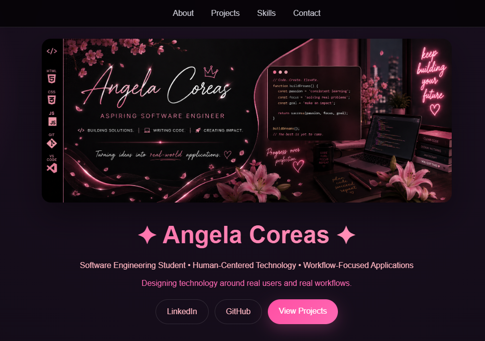
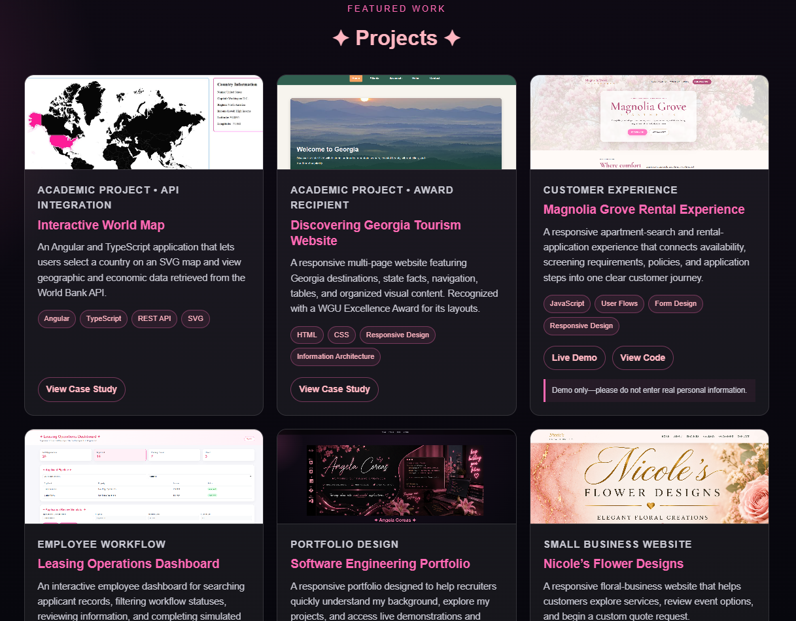

<p align="center">
  
</p>

<h1 align="center">✦ Angela Coreas | Software Engineering Portfolio ✦</h1>

<p align="center">
  <b>Software Engineering Student • Building Real-World Solutions Through Code</b>
</p>

<p align="center">
Showcasing projects, technical growth, and hands-on development experience while pursuing a Software Engineering degree.
</p>

<br/>

<p align="center">


</p>

<br/>

<p align="center">
  <a href="https://github.com/angelacoreas1989-boop">
    
  </a>

  <a href="https://angelacoreas1989-boop.github.io/tech-portfolio/">
    
  </a>

  <a href="https://www.linkedin.com/in/angela-coreas-550088186">
    
  </a>

  <a href="https://angelacoreas1989-boop.github.io/tech-portfolio/">
    
  </a>
</p>

---

## ✦ LIVE DEMO ✦

🔗 https://angelacoreas1989-boop.github.io/tech-portfolio/

---

## ✦ PURPOSE ✦

As I transition into software engineering, I wanted a centralized platform to showcase my projects, technical skills, and professional growth.

This portfolio serves as a professional hub where recruiters, hiring managers, and fellow developers can explore my work, follow my learning journey, and view the projects I continue to build while pursuing my Software Engineering degree.

---

## ✦ PROJECT OVERVIEW ✦

This portfolio website was designed and built to present my software engineering journey in a polished and professional way.

It highlights my technical skills, featured projects, background in operations and CRM systems, and continued growth as I build real-world applications using HTML, CSS, JavaScript, Git, GitHub, and modern development tools.

---

## ✦ FEATURES ✦

✦ Custom branded portfolio banner

✦ Responsive design for desktop and mobile devices

✦ Featured project showcase

✦ About Me section

✦ Skills section

✦ Contact section

✦ GitHub and LinkedIn integration

✦ Smooth navigation experience

✦ GitHub Pages deployment

---

## ✦ TECH STACK ✦

<p align="center">
  
</p>

<p align="center">
HTML • CSS • JavaScript • Git • GitHub • VS Code
</p>

---

## ✦ SKILLS DEMONSTRATED ✦

✦ Front-End Development Foundations

✦ Responsive Web Design

✦ UI Design & Layout Structure

✦ Personal Branding & Portfolio Development

✦ HTML & CSS Development

✦ JavaScript Fundamentals

✦ Git Version Control

✦ GitHub Repository Management

✦ GitHub Pages Deployment

✦ Professional Project Documentation

---

## ✦ SCREENSHOTS ✦

### ✦ Portfolio Homepage ✦



### ✦ Featured Projects Section ✦



---

## ✦ WHAT I LEARNED ✦

✦ How to structure and deploy a professional portfolio website

✦ How to showcase technical projects for recruiters and hiring managers

✦ How to create consistent branding across GitHub repositories

✦ How to improve responsive layouts and user experience

✦ How to present projects as professional case studies

✦ How to connect technical skills, projects, and career goals into a single platform

---

## ✦ FUTURE ENHANCEMENTS ✦

✦ Add additional software engineering projects

✦ Incorporate React-based components

✦ Add downloadable resume functionality

✦ Expand project case studies

✦ Improve animations and interactions

✦ Continue updating as new projects are completed

---

## ✦ PROJECT STRUCTURE ✦

```text
tech-portfolio/
├── assets/
│   ├── angela-coreas-banner.png
│   ├── portfolio-homepage.png
│   └── projects-section.png
├── index.html
├── style.css
├── script.js
└── README.md
```

---

## ✦ AUTHOR ✦

**Angela Coreas**

Software Engineering Student • Operations & CRM Professional

LinkedIn:
https://www.linkedin.com/in/angela-coreas-550088186

GitHub:
https://github.com/angelacoreas1989-boop

Portfolio:
https://angelacoreas1989-boop.github.io/tech-portfolio/

---

<p align="center">
  ✦ Building Solutions • Writing Code • Creating Impact ✦
</p>

<p align="center">
  <i>💗 Building consistently. Learning intentionally. Creating real-world solutions. 💗</i>
</p>

<p align="center">
  ✦
</p>
